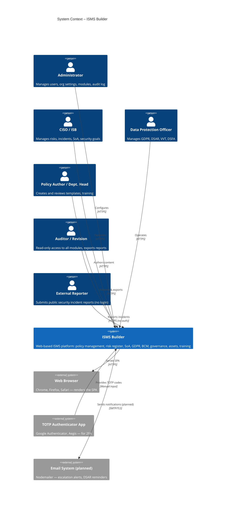
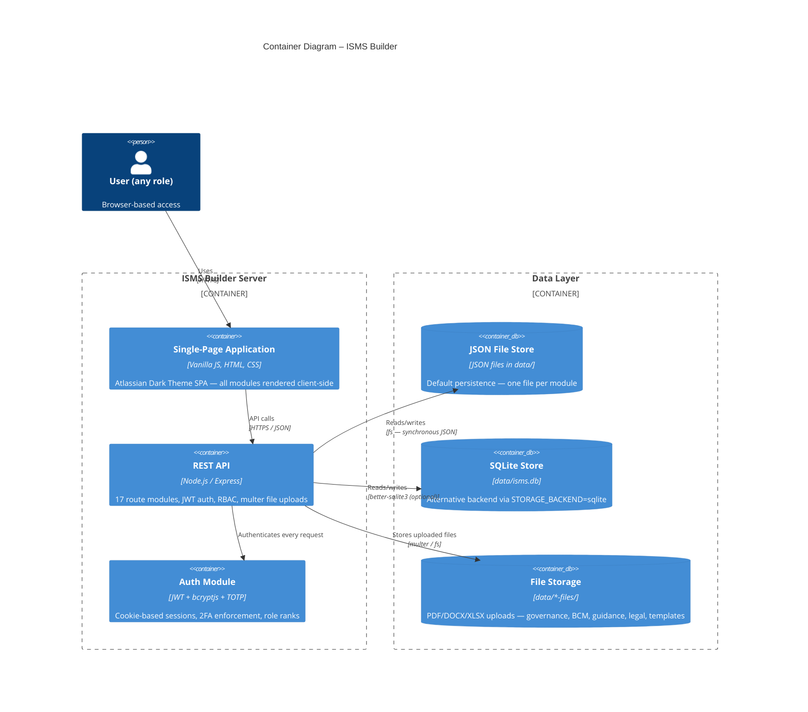
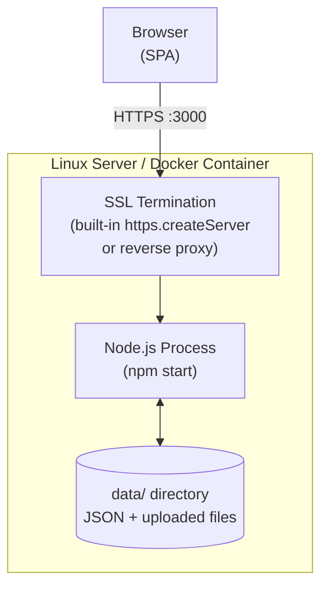

# ISMS Builder – C4 Architecture Diagrams

Diagrams follow the [C4 model](https://c4model.com/). Rendered with Mermaid.

---

## Level 1 – System Context

Who uses the system and what external systems does it interact with?



---

## Level 2 – Container

What are the main deployable units?



---

## Level 3 – Component (API Server)

What are the internal building blocks of the API server?

```mermaid
C4Component
  title Component Diagram – API Server (server/)

  Container_Boundary(api, "Express API Server") {

    Component(idx, "index.js", "Express app setup", "Mounts all routers, serves UI with auth guard, starts HTTPS/HTTP")

    Component_Boundary(routes, "server/routes/ — Express Routers") {
      Component(r_auth, "auth.js", "Router", "Login, logout, whoami, /me/password, 2FA setup/verify/disable")
      Component(r_tmpl, "templates.js", "Router", "Template CRUD, versioning, lifecycle, hierarchy, attachments, entities")
      Component(r_soa, "soa.js", "Router", "SoA controls, frameworks, crossmap, bidirectional template links")
      Component(r_risk, "risks.js", "Router", "Risk register, treatments, calendar events")
      Component(r_goal, "goals.js", "Router", "Security objectives, KPI tracking")
      Component(r_asset, "assets.js", "Router", "Asset inventory, classification, EoL tracking")
      Component(r_gov, "governance.js", "Router", "Management reviews, actions, meetings, document uploads")
      Component(r_bcm, "bcm.js", "Router", "BIA, continuity plans, exercises, document uploads")
      Component(r_cal, "calendar.js", "Router", "Aggregated calendar events from all modules")
      Component(r_guid, "guidance.js", "Router", "Guidance documents, PDF/DOCX upload")
      Component(r_gdpr, "gdpr.js", "Router", "VVT, AV, DSFA, TOMs, DSAR, incidents, DSB upload")
      Component(r_rep, "reports.js", "Router", "Compliance, framework, gap, matrix, review, CSV export")
      Component(r_leg, "legal.js", "Router", "Contracts, NDAs, privacy policies, file attachments")
      Component(r_train, "training.js", "Router", "Training records, completion tracking")
      Component(r_adm, "admin.js", "Router", "Users, org settings, modules, lists, audit log, dashboard, maintenance")
      Component(r_pub, "public.js", "Router", "Public incident reporting (no auth), entity list")
      Component(r_trash, "trash.js", "Router", "Soft-delete trash, permanent delete, restore, full JSON export")
    }

    Component_Boundary(stores, "server/db/ — Data Stores") {
      Component(s_json, "jsonStore.js", "Store", "Template persistence (JSON)")
      Component(s_sqlite, "sqliteStore.js", "Store", "Template persistence (SQLite, same API)")
      Component(s_soa, "soaStore.js", "Store", "313 SoA controls, all frameworks, seed + merge")
      Component(s_risk, "riskStore.js", "Store", "Risks + treatments, soft-delete")
      Component(s_gdpr, "gdprStore.js", "Store", "9 GDPR sub-modules")
      Component(s_gov, "governanceStore.js", "Store", "Reviews, actions, meetings")
      Component(s_bcm, "bcmStore.js", "Store", "BIA, plans, exercises")
      Component(s_other, "…Store.js ×9", "Stores", "goals, assets, training, legal, guidance, audit, org, lists, publicIncident")
    }

    Component(authmod, "auth.js", "Middleware", "requireAuth (JWT cookie), authorize (role rank), signToken")
    Component(rbac, "rbacStore.js", "Store", "Users, passwords (bcrypt), TOTP secrets, role management")
    Component(storage, "storage.js", "Facade", "Selects json or sqlite backend via STORAGE_BACKEND env var")
    Component(rep, "reports.js", "Logic", "Compliance matrix, gap analysis, review cycles, CSV builder")
  }

  Rel(idx, r_auth, "app.use()")
  Rel(idx, r_tmpl, "app.use()")
  Rel(idx, r_soa, "app.use()")
  Rel(idx, r_adm, "app.use()")
  Rel(r_auth, authmod, "uses")
  Rel(r_auth, rbac, "verifyPassword, setPasswordHash, confirmTotpVerified")
  Rel(r_tmpl, storage, "getTemplate, createTemplate, updateTemplate")
  Rel(r_soa, s_soa, "getControl, updateControl")
  Rel(r_gov, s_gov, "getReviews, createReview, …")
  Rel(r_bcm, s_bcm, "getBia, createPlan, …")
  Rel(r_rep, rep, "generateReport")
  Rel(storage, s_json, "json backend")
  Rel(storage, s_sqlite, "sqlite backend")
```

---

## Deployment View



Deployment options:
- **Direct**: `node server/index.js` — SSL via `SSL_CERT_FILE` + `SSL_KEY_FILE` in `.env`
- **Docker**: `docker compose up -d --build`
- **Reverse proxy**: nginx/Caddy in front, app on HTTP internally
